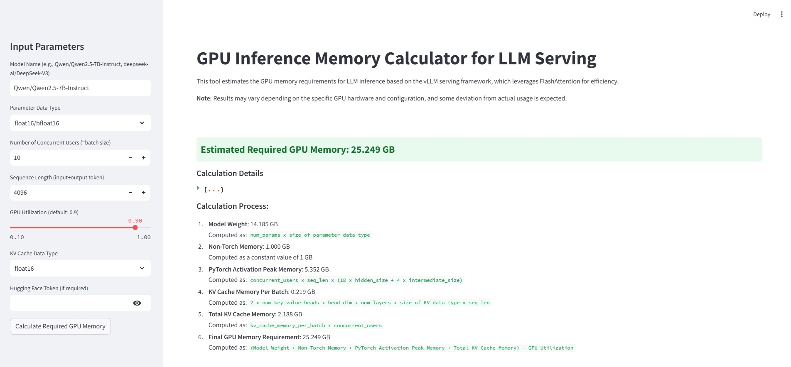

### 📌 **LLM-GPU-Calc**

**Estimate GPU Memory Requirements for Large Language Model (LLM) Serving with vLLM**



Website:

Related Blog: https://medium.com/@kimdoil1211/how-much-gpu-memory-do-you-really-need-for-efficient-llm-serving-4d26d5b8b95b

## 🚀 **Overview**

**LLM-GPU-Calc** is a lightweight tool designed to estimate GPU memory usage for LLM inference, specifically for **vLLM-based serving**. It helps AI practitioners, engineers, and researchers optimize GPU resource allocation based on key model parameters, KV cache size, and concurrent user requirements.

🔹 **Key Features**

- 📊 **Estimate Required GPU Memory** for LLM inference
- ⚡ **Breakdown of KV Cache, Model Weights, and Activation Memory**
- 🔍 **Supports Parameter Data Types (FP16, FP8, INT4, etc.)**
- 🖥️ **Optimize Concurrent User Handling for Efficient Serving**
- 🔗 **Integrates with Hugging Face Model API for Configurations**

---

## 🔧 **Installation**

Clone the repository and install dependencies:

```bash
git clone https://github.com/gjgjos/LLM-GPU-Calc.git
cd LLM-GPU-Calc
pip install -r requirements.txt
```

---

## 📌 **Usage**

Run the Streamlit-based UI:

```bash
streamlit run app.py
or
python -m streamlit run app.py
```

## 🧠 **Understanding GPU Memory Calculation**

The required GPU memory for inference is calculated using the following formula:

```python
Required GPU Memory = [(model_weight + non_torch_memory + pytorch_activation_peak_memory)
+ kv_cache_memory_per_batch * concurrent_users] / gpu_memory_utilization
```

### **Key Components**

| Component                          | Description                                      |
| ---------------------------------- | ------------------------------------------------ |
| **Model Weight**                   | Memory occupied by model parameters              |
| **KV Cache Memory**                | Stores key-value pairs for transformer attention |
| **Non-Torch Memory**               | Memory used for CUDA and etc                     |
| **PyTorch Activation Peak Memory** | Memory used for intermediate activations         |
| **GPU Utilization Factor**         | Fraction of GPU memory allocated for inference   |

### **KV Cache Calculation**

```python
kv_cache_memory_per_batch = (2 * kv_attention_heads * head_dim * num_layers * kv_data_type_size) * sequence_length
```

- `kv_attention_heads`: Number of key-value attention heads
- `head_dim`: Dimensionality of each attention head
- `num_layers`: Number of transformer layers
- `sequence_length`: Sum of input and output tokens

---

## 📈 **Estimating Maximum Concurrent Users**

When available KV cache memory is exhausted, requests are queued, increasing **Time to First Token (TTFT)**. The maximum number of concurrent users a GPU can support is:

```python
max_concurrent_users = available_kv_cache_memory // kv_cache_memory_per_batch
```

### **Example Calculation**

**Assumptions:**

- **Total GPU Memory:** 40GB
- **GPU Utilization:** 90% (0.9)
- **Model Weight:** 15GB
- **Non-Torch Memory:** 400MB
- **PyTorch Activation Peak Memory:** 1GB

**Calculation:**

```python
available_kv_cache_memory = (40 * 0.9 - 15 - 0.4 - 1) = 19.6 GB
```

If each batch requires **200MB** for KV cache:

```python
max_concurrent_users = 19.6GB // 200MB = 98 users
```

---

## 🛠 **Future Improvements**

- ✅ Support for **multi-GPU parallel inference**
- ✅ Advanced profiling tools for **real-time monitoring**
- ✅ Integration with **Kubernetes for scalable LLM deployment**

---

## 🙌 **Contributions**

We welcome contributions! Feel free to **open an issue**, submit a **pull request**, or improve documentation. Let me know if you need any modifications. 😊

---

## 📬 **Contact**

📌 **Author:** [gjgjos](https://github.com/gjgjos)  
📌 **GitHub:** [LLM-GPU-Calc](https://github.com/gjgjos/LLM-GPU-Calc)
